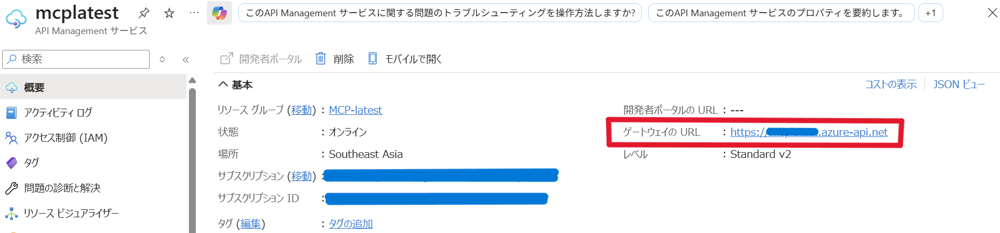

# MCP_Bicep – RSS-MCP

このリポジトリは Azure Functions + API Management (APIM) 上で稼働する Remote MCP サーバーです。VS Code などの MCP クライアントから SSE で接続し、RSS/Atom フィードの取得・集約・フィルタができます。

- ### 提供ツール
  - list_presets: ビルトインのRSSプリセット一覧とサンプルを返します。
  - fetch_rss: URL/urlList または preset でフィード取得。maxItems, sinceHours, keyword, includeSummary, timeoutSec などで絞り込み可能。
- 主なプリセット: azure_blog, azure_updates_rc, zenn_trend, zenn_user(zennUser 必須), zenn_topic(zennTopic 必須)
  
- ### 実行例（クライアントで tool を呼ぶ際の arguments 例）
  - Azure Blog を5件: {"preset":"azure_blog","maxItems":5}
    - プロンプト例: `Azure Blogから５件の最新情報を取得して。use fetch_rss`
  
  - urlからRSS情報を取得
    - プロンプト例（Zenn マイクロソフト有志の会）:　`https://zenn.dev/p/microsoft/feed このurlから１０件の最新情報を取得して。use fetch_rss`
  
    - プロンプト例 (Power BI ブログを10件)： `https://powerbi.microsoft.com/en-us/blog/feed/ここから、10件の最新の情報を取ってきて。use fetch_rss`
  
  - 複数URL＋キーワード/期間」： {"urlList":"https://a.example/feed https://b.example/feed","keyword":"Azure","sinceHours":48}
    - プロンプト例： `https://zenn.dev/p/microsoft/feed, https://powerbi.microsoft.com/en-us/blog/feed/,この2つのurlから、Azureに関する最新記事を取得して。use fetch_rss`
  
  - Zennトピック(azure)の最近72時間： {"preset":"zenn_topic","zennTopic":"azure","sinceHours":72}
    - プロンプト例： `zenn_topicから、azureに関する最新記事5件を取得して。use fetch_rss`
  
  - Zennのユーザー用プリセットを使って yamadakz のRSSを取得し、最新5件を要約付きで一覧化
    - プロンプト例： `zenn_userである、yamadakzの最新の記事５つを教えてください。use fetch_rss`

---

## 前提条件

- Azure Developer CLI (azd) がインストール済みでサインイン済みであること
- Azure CLI がインストール済みであること
- Git 環境があること（このリポジトリを取得するため）
- `./mcp-code` に Function のコードが配置されていること

> OS: Windows、既定シェル: PowerShell / Comand Prompt を想定したコマンド例を記載しています。

> ログインに関して:
> - azd のみで運用する場合は、`azd auth login` のみで十分です。
> - Azure CLI を併用して `az group create` などのコマンドを使う場合は、`az login`（必要に応じて `az account set`）も実施してください。

---

## Azure Developer CLIのインストール（必須）

以下は公式ドキュメントで案内されている代表的なインストール方法です。環境に応じて 1 つを実行してください。

### Windows

PowerShell（既定のシェル）で実行:

```powershell
# winget
winget install microsoft.azd

# もしくは Chocolatey
choco install azd

# もしくは PowerShell スクリプト（署名済みスクリプト実行ポリシーで）
powershell -ex AllSigned -c "Invoke-RestMethod 'https://aka.ms/install-azd.ps1' | Invoke-Expression"
```

### macOS

```bash
brew tap azure/azd && brew install azd
```

### Linux

```bash
curl -fsSL https://aka.ms/install-azd.sh | bash
```

これらの方法は azd 本体に加えて、必要な依存ツール（Git CLI や Bicep CLI など）も導入します（learn.microsoft.com 参照）。

---

## サインイン（初回のみ）

インストール後、Azure アカウントにサインインして azd に認証情報を与えます。公式の「Get started using Azure Developer CLI」に従い、次を実行してください。

```powershell
azd auth login
```

既定のブラウザーが開き Azure のサインイン画面が表示されます。サインインが完了すると azd に認証が保存され、`azd up` などのコマンドでサブスクリプションやリージョンの指定プロンプトが利用できるようになります。

補足: Azure CLI 側で `az login` 済みでも認証が共有される場合はありますが、azd のドキュメントでは `azd auth login` の利用が推奨されています。

---

## セットアップと環境作成

- 変数例
  - サブスクリプション ID: `<your-subscription-id>`
  - 環境名: `dev`
  - リージョン: `japaneast`

```powershell
# リポジトリをクローン
git clone https://github.com/YamadaKZ/MCP_Bicep.git
cd MCP_Bicep

## サインイン（初回のみ）

インストール後、Azure アカウントにサインインして azd に認証情報を与えます。公式の「Get started using Azure Developer CLI」に従い、次を実行してください。

```powershell
azd auth login
```


# 環境を作成（dev 環境／リージョン: japaneast）
```powershell

# 環境を作成（dev 環境／リージョン: japaneast）
azd env new dev --subscription <your-subscription-id> --location japaneast
```

- `azd env new` 実行後に `.azure/dev.env` が生成され、`AZURE_SUBSCRIPTION_ID` や `AZURE_RESOURCE_GROUP` 等が保存されます。基本的に `.env` の手動作成は不要です。

---

## 初回デプロイ（mcpFunctionsKey を空で）

初回は `main.bicep` のパラメータ `mcpFunctionsKey` を空文字列のままインフラを構築します。

```powershell

# インフラと Functions コードを一括デプロイ
azd up
```

完了後、出力には以下が表示されます：
- Function App の URL（例: `https://<function-host>.azurewebsites.net`）
- APIM のゲートウェイ URL（例: `https://<apim-name>.azure-api.net`）

続いて Azure ポータルで Function App を開き、[機能拡張 (Extensions)] から `mcp_extension` の System key をコピーします。これが APIM -> Functions 呼び出し時の `x-functions-key` になります。


## システムキーの登録と APIM 更新（再デプロイ）

取得した System key を Bicep パラメータ `mcpFunctionsKey` に設定し、APIM の Named Value `mcp-functions-key` を更新します。次のいずれかの方法を選択してください。

### 方法 A: 環境ファイル（推奨）に登録

`BICEP_PARAM_<パラメータ名>` 形式の環境変数は azd により Bicep パラメータへ自動で渡されます。

```powershell
# dev 環境ファイルにキーを保存（.azure/dev.env に追記されます）
azd env set BICEP_PARAM_MCPFUNCTIONSKEY <取得したキー>

# 再デプロイ（APIM の Named Value が更新されます）
azd up
```

以降は環境ファイルに値が保持されるため、毎回の入力は不要です。

### 方法 B: パラメータファイルで指定

`infra/infra.parameters.json`（なければ作成）に次のように追記します。

```json
{
  "$schema": "https://schema.management.azure.com/schemas/2019-04-01/deploymentParameters.json#",
  "contentVersion": "1.0.0.0",
  "parameters": {
    "mcpFunctionsKey": {
      "value": "<取得したキー>"
    }
  }
}
```

その後、再度 `azd up` を実行してください。


---

## 動作確認

VS CodeからAPIM経由でMCPサーバーに接続できることを確認します。

### VS Codeの設定

`.vscode/mcp.json` の設定は以下になります：

```json
{
  "servers": {
    "remote-mcp-via-apim": {
      "type": "sse",
      "url": "https://<apim-name>.azure-api.net/mcp/runtime/webhooks/mcp/sse"
    }
  }
}
```

設定値：

- <apim-name>：APIMの既定ドメイン
- APIMリソース概要のゲートウェイのURLで確認できます




## 完全クローズドにする

最後に Azure Functions 側の公開アクセスを無効化すれば、Private Endpoint 経由以外の受信を拒否できます。


- Azure Portal → 対象の Azure Function → ネットワーク
- 公衆ネットワーク アクセス: 無効 に設定


## クリーンアップ

リソースを削除する場合は次を実行します（作成した Azure リソースが削除されます）。

```powershell
azd down
```

> 実行前に削除対象や課金影響を必ずご確認ください。

---


## ライセンス
使用・コード変更可能。
